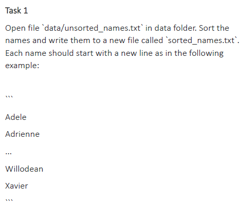
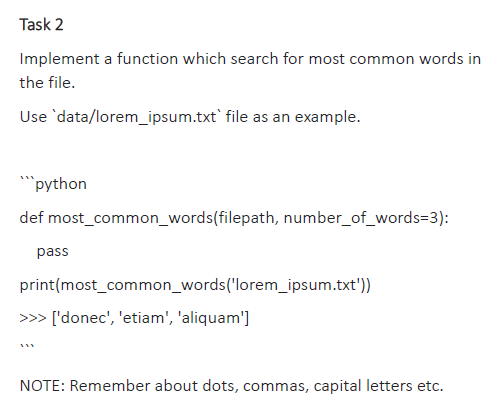
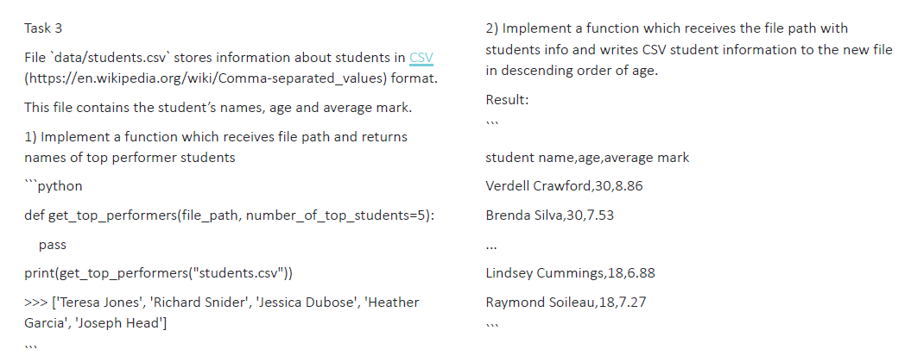

# Usage  

```bash
exercise_1.py
exercise_2.py
exercise_3.py
```

# Tasks & Solutions

### Exercise 1  

  
  
* `sort_names` function receives as a string a path to the file and returns a sorted list of lines in this file.
```python
    def sort_names(path: str) -> list:
        with open(path, 'r', encoding='utf-8') as f:
            lst = f.readlines()
            # list of lines with \n at the end of line
        return sorted(lst)
```  
* `write_names` function receives two paths as arguments: the 1st is the file with unsorted names, the 2nd is existing or
new file we are going to write the sorted names to.

```python
    def write_names(from_: str, to_: str):
        with open(to_, 'w', encoding='utf-8') as f:
            f.writelines(sort_names(from_))
            # write the items of a list to the file (character by character, line breaks should be at the end of each item)
```

### Exercise 2  
  
  
  
In order to solve this task I created a list of all words in the text file, using regex `[a-zA-Z]+` (it matches only 
sequences of letters) and re.findall method.
Then I created a dictionary that counts frequency of all the words in this list.
Finally, I created a list_of_words list where the key-value pairs from the dictionary are sorted by value in reversed order.  
The function returns a list with n elements where n is defined by number_of_words argument (default value is 3)
```python
    import re
    
    
    def most_common_words(path: str, number_of_words=3) -> list:
        with open(path, 'r', encoding='utf-8') as f:
            txt = f.read()
            lst = re.findall(r'[a-zA-Z]+', txt)
            counts = {}
            for word in lst:
                if word not in counts:
                    counts[word] = 1
                else:
                    counts[word] += 1
    
        list_of_words = sorted([(k, v) for k, v in counts.items()], key=lambda x: x[1], reverse=True)
        return list_of_words[0:number_of_words]
```  

### Exercise 3  

  

* `top_performer_students` function uses `csv` module in order to create the csv_reader iterator.  
Then I create a dictionary `grades` where where key-value pair is student's name and student's grade.  
The dictionary is transformed into a `top_students` sorted list using `sorted` function with the grade value as a key and 
reversed sorting order.  
The function returns a list with n elements where n is defined by number_of_top_students argument (default value is 5)

```python
    import csv
    
    def top_performer_students(path: str, number_of_top_students=5) -> list:
        with open(path) as csv_file:
            # csv_reader iterator through the lines, each line is represented as a list
            csv_reader = csv.reader(csv_file, delimiter=',')
            # skip the header
            next(csv_reader)
    
            grades = {}
            for row in csv_reader:
                grades[row[0]] = row[2]
            top_students = sorted([(k, v) for k, v in grades.items()], key=lambda x: float(x[1]), reverse=True)
            return top_students[0:number_of_top_students]
```  

* `sorted_by_age` function creates a list of rows, sorted by age and then writes those rows into new csv file. 

```python
    def sorted_by_age(from_: str, to_: str):
        with open(from_, encoding='utf-8') as from_csv_file, open(to_, 'w', newline='', encoding='utf-8') as to_csv_file:
            csv_reader = csv.reader(from_csv_file, delimiter=',')
            csv_writer = csv.writer(to_csv_file, delimiter=',')
            sorted_list = sorted(csv_reader, key=lambda row: row[1], reverse=True)
            for row in sorted_list:
                csv_writer.writerow(row)
```


 
