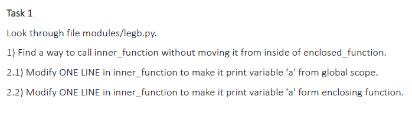
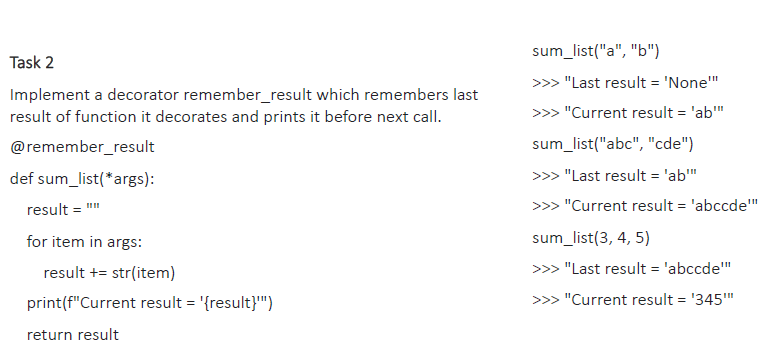
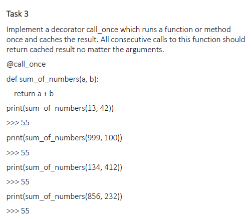
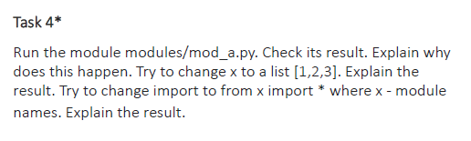

# Usage

```bash
exercise_2.py
exercise_3.py
```

# Task1  

  

1. To call inner_function we should add `return inner_function()` statement at the end of `enclosing_function()`.  

```python
    a = "I am global variable!"
       
    def enclosing_function():
        a = "I am variable from enclosed function!"   
        def inner_function():    
            a = "I am local variable!"
            print(a)
    return inner_function()
```  
This way when we call `enclosing_function()`, `inner_function()` will be executed.
  
2.1. To print global variable `a`:  
```python
a = "I am global variable!"
       
    def enclosing_function():
        a = "I am variable from enclosed function!"   
        def inner_function():    
            global a
            print(a)
    return inner_function()
```  

2.2. To print variable `a` from enclosing function:  
```python
a = "I am global variable!"
       
    def enclosing_function():
        a = "I am variable from enclosed function!"   
        def inner_function():    
            nonlocal a
            print(a)
    return inner_function()
```  

# Task2  

  

In order to preserve the result of previous `sum_list` function calls I created global variable `result`.  
The decorator function `remember_result` when executing first define its variable `result` as global and prints its value 
which equals the value of the previous `sum_list` call (None if it is the first call). Then decorator executes the `sum_list` 
function and modifies the global `result` variable.  
Finally, the decorator function prints out the current result of the execution.  

```python
    result = None
    
    def remember_result(original_function):
        def wrapper_function(*args):
            global result
            print(f"Last result = '{result}'")
            result = original_function(*args)
            print(f"Current result = '{result}'")
            return original_function(*args)
        return wrapper_function
    
    @remember_result
    def sum_list(*args):
        result = ""
        for item in args:
            result += str(item)
        return result
``` 

# Task3  

  
  
Decorator function `call_once` stores arguments from the first `sum_of_numbers` call in global variable `initial_arguments` 
if it is None (i. e. the function `sum_of_numbers` is called for the first time).  
Each next call the decorator will repace original arguments with the arguments stored in the global variable `initial_arguments`.  

```python
    initial_arguments = None
    
    def call_once(original_function):
        def wrapper_function(*args):
            global initial_arguments
            if initial_arguments is None:
                initial_arguments = [*args]
            return original_function(*initial_arguments)
        return wrapper_function
    
    @call_once
    def sum_of_numbers(a, b):
        return a+b
```

# Task4  

  

Let's run mod_a through import this module in `exercise_4.py` from parent directory:  
```python
    import sys
    
    sys.path.append('./modules/')
    
    import mod_a
```
Output:  
5  

It happened because mod_a script imports `mod_c` module and prints out variable `x` defined in `mod_c`.  
If we would change the value of `x` in `mod_c` and run it again, the output would be still 5, because `mod_a` also imports 
`mod_b` and the variable `x` from `mod_c` is set as 5 from `mod_b`.  
Nothing changes if we change import to from x import * where x - module names, because in the case of singl `import mod_a` 
statement we import all other modules through `mod_a` import statements `import mod_b` and `import mod_c`.


  