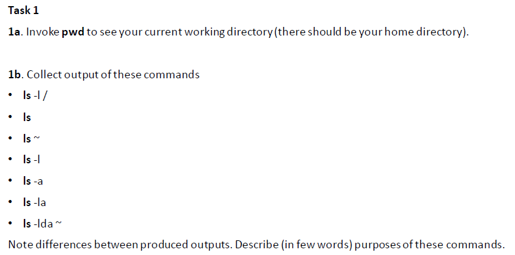
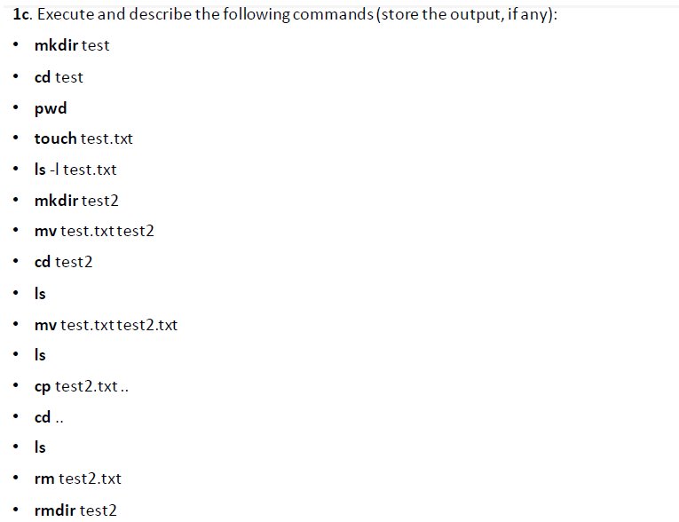
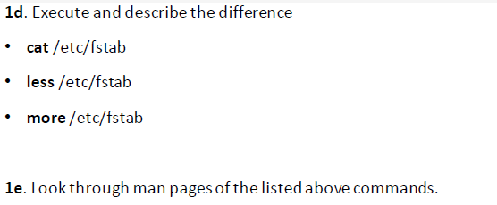
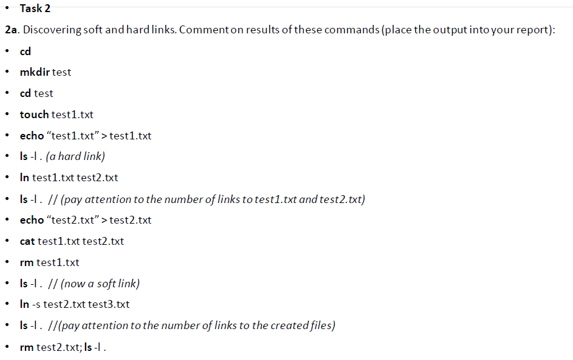
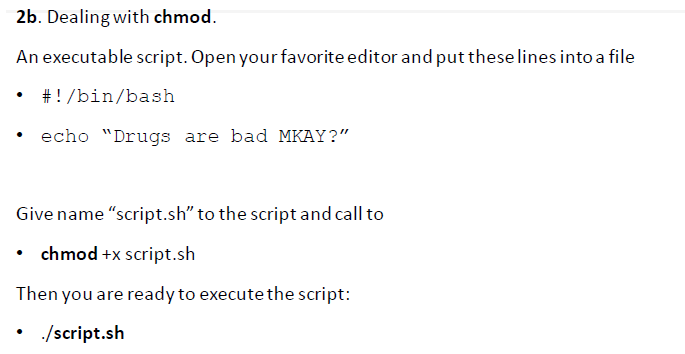

# Task 1  

  
  
pwd - print working directory  
ls - list files (and directories, devices etc. - everything is a file in linux)  
~ - shortcut for home directory  
-l - long listing format  
-a - flag '--all' is used to list all files including the hidden ones
-d - flag '--directory' is used to list only directories

  
  
mkdir - make directory, cd - change directory  
touch - create empty file  
mv - move (or rename) the file  
cp - copy the file  
.. - parent directory  
rmdir - remove directory (if empty)  
rm - remove file  

I coudn't remove test2 directory using `rmdir test2` command, bcz the original file was still there.  
To remove test2 directory I used `rm -r` command which removed the directory recursively

  
  
`cat` prints out the whole content of file, while `more` prints out some part of the content and we can show more using 
space key or print out more using enter key.  
`less` creates another terminal space and we can navigate through the content of file using up and down keys.  

# Task 2

  

  

