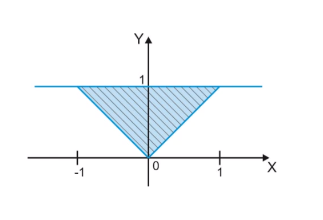

# Task

### Exercise 1

Write a program that determines whether the Point(x,y) is in the shaded area or not. <br><br>


### Exercise 2 : FizzBuzz

Write a program that prints the input number from 1 to 100.  
But for multiple of three print "Fizz" instead of the number and for the multiples of five print "Buzz".  
For numbers which are multiples of both three and five print "FizzBuzz"

### Exercise 3 : Baccarat

* Simulate the one round of play for baccarat game
* Rules:
    * cards have a point value:
        * the 2 through 9 cards in each suit are worth face value (in points);
        * the 10, jack, queen, and king have no point value (i.e. are worth zero);
        * aces are worth 1 point;
    * Sum the values of cards. If total is more than 9 reduce 10 from result
    * Player is not allowed to play another cards like joker

# Task Execution

### Exercise 1

The area has two conditions: y >= abs(x) and y <= 1.  
If the conditions are met validate_point function returns True, if not - False

### Exercise 2

The main function takes input from the infinite loop with the condition to break the execution if the input is 'q'.  
The main function also contains try-except construction when converting the input into integer.  
Then the input converted into integer goes into check_number function, which checks following conditions and returns corresponding result:
```python
    if not 0 < i < 100:
        return 'The number should be from 1 to 100\n'
    if i % 3 == 0 and i % 5 == 0:
        return 'FizzBuzz'
    elif i % 3 == 0:
        return 'Fizz'
    elif i % 5 == 0:
        return 'Buzz'
    else:
        return i
``` 

### Exercise 3

First I created a dictionary with card values
```python
values = {'2': 2, '3': 3, '4': 4,
          '5': 5, '6': 6, '7': 7,
          '8': 8, '9': 9, '10': 0,
          'J': 0, 'Q': 0, 'K': 0, 'A': 1}
```

Then I made main function which receives input and later passes it into the play(c1, c2) function:
```python
if __name__ == '__main__':
    c1 = input('Play first card: ')
    c2 = input('Play second card: ')
    if c1 not in values or c2 not in values:
        print('Input invalid. Please try again!')
        exit()
    result = play(c1, c2)
    print(f'Your result: {result}')
```

Finally, I created a function which produces a result due to the given conditions:
```python
def play(c1, c2):
    if c1.lower() == 'joker':
        return 'Do not cheat!'
    total = values[c1] + values[c2]
    if total > 9:
        total -= 10
    return total
```
# Usage

```bash
exercise_1.py
exercise_2.py
exercise_3.py
```
