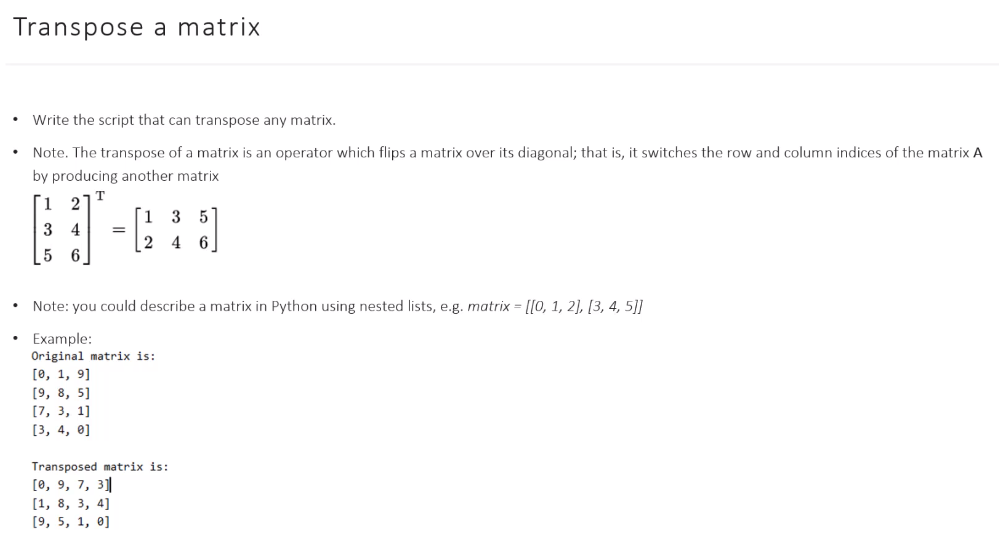
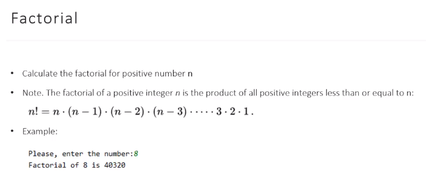
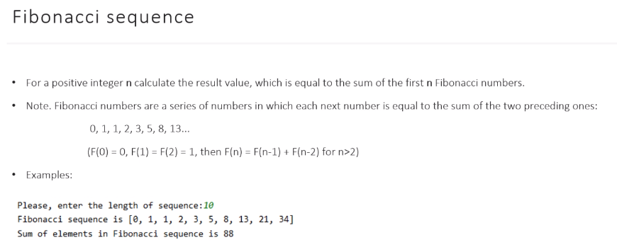
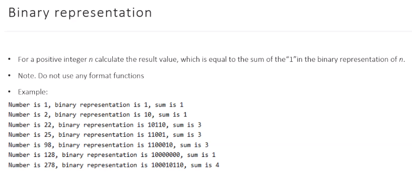

# Tasks & Solutions

### Exercise 1

  

To solve this problem I used nested loop which creates transposed matrix (t_matrix).  
The outer loop constructs the list of empty lists and the inner loop fills those lists with proper values.  

```python
def transpose_matrix(matrix: list) -> list:
    t_matrix = []
    # The number of elements of new matrix equals the number of elements in first element of the original matrix
    length = len(matrix[0])

    index = 0
    for n in range(length):
        t_matrix.append([])
        for i in range(len(matrix)):
            t_matrix[n].append(matrix[i][index])
        index += 1
    return t_matrix
```

### Exercise 2

  

I solved it using recursion, which is not recommended because of possible stack overflow.  
Default python recursion depth is 1000 which allows us to calculate only factorial of numbers less than 999.

```python
# 1. using recursion. NOT RECOMMENDED!!!
# def fac(n):
#     if n == 1:
#         return 1
#     else:
#         return n * fac(n-1)
```

Recommended solution would be a simple for loop:  

```python
def fac(n):
    f = 1
    for i in range(1, n+1):
        f *= i
    return f
```

### Exercise 3

  

The function fib_sequence takes an integer n as an argument and calculates the list of fibonacci numbers with n elements.  
Then we can use this list to calculate the sum of the numbers using built-in sum function.

```python
def fib_sequence(n) -> list:
    lst = [1]
    fib_num = 1
    for i in range(n-1):
        lst.append(fib_num)
        fib_num += lst[-2]
    return lst
```  

### Exercise 4

  

Function bin_num converts decimal integer into string representation of binary number.  
  
```python
def bin_num(n) -> str:
    bin_str = ''
    while n > 0:
        bin_str += str(n%2)
        n //= 2
    return bin_str[::-1]
```  

Then I use built-in count method to calculate the number of '1' in this string.  

# Usage

```bash
exercise_1.py
exercise_2.py
exercise_3.py
exercise_4.py
```
