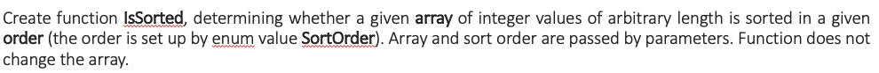
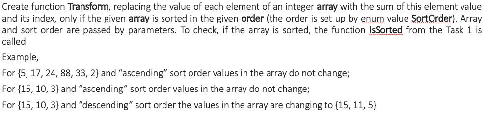
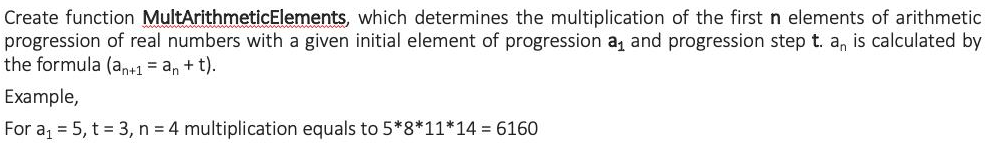
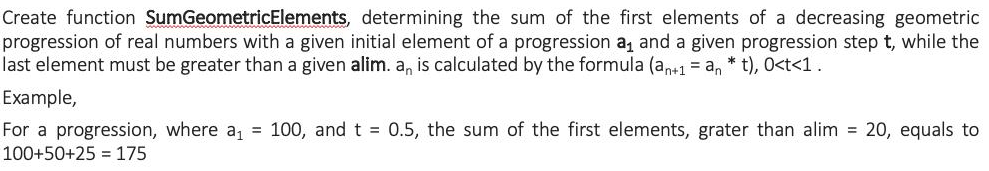

# Tasks & Solutions

### Exercise 1

  

The function is_sorted compares each number from the array with its next number and depending on the presumed order of sorting returns True or False.  

```python
def is_sorted(array, order) -> bool:
    array = array
    itr = iter(array)

    next(itr)
    try:
        for num in array:
            if num <= next(itr) and order == 'ASC':
                continue
            elif num >= next(itr) and order == 'DESC':
                continue
            else:
                return False
    except StopIteration:
        return True
```

Check function makes up to 2 calls of is_sorted function (with 'ASC' and 'DESC' arguments) and depending on the result prints the output.  
  
```python
def check(array):
    if is_sorted(array, 'ASC'):
        print(f'The array {array} is sorted in ascending order')
    elif is_sorted(array, 'DESC'):
        print(f'The array {array} is sorted in descending order')
    else:
        print(f'The array {array} is unsorted')
```

### Exercise 2

  

For this exercise I imported function is_sorted from exercise_1 and used it in the transform function.
If the condition was met, the transform function zips indices and values of the array and then calculates values of the transformed array.  
If the condition wasn't met, the transform function returns the same array without changes.  

```python
def transform(array, order):
    if is_sorted(array, order):
        zipped_array = zip(range(len(array)), array)
        t_array = [i[0] + i[1] for i in zipped_array]
        return t_array
    else:
        return array
```

### Exercise 3

  

To solve this exercise I created mult_arithmetic_elements function which takes 3 numbers as arguments and returns multiplication of the progression numbers:  
Input validation provided in the main function.

```python
def mult_arithmetic_elements(a: float, n: int, step: float):
    """
    :param a: initial value
    :param n: number of elements
    :param step: progression step
    :return: multiplication of the elements of arithmetic progression
    """
    mult = 1
    for i in range(n):
        mult *= a
        a += step
    return mult  
```

### Exercise 4

  

To solve this exercise I created sum_geometric_elements function which takes 3 numbers as arguments and returns sum of the progression numbers:  
Input validation provided in the main function.  

```python
def sum_geometric_elements(a: float, alim: float, step: float):
    """
    :param a: initial value
    :param alim: limit value of the progression (element of the progression can't be less then this value)
    :param step: progression step; 0<step<1
    :return: sum of the elements of geometric progression
    """
    sum = 0
    while a > alim:
        sum += a
        a *= step
    return sum
```

# Usage

```bash
exercise_1.py
exercise_2.py
exercise_3.py
exercise_4.py
```
