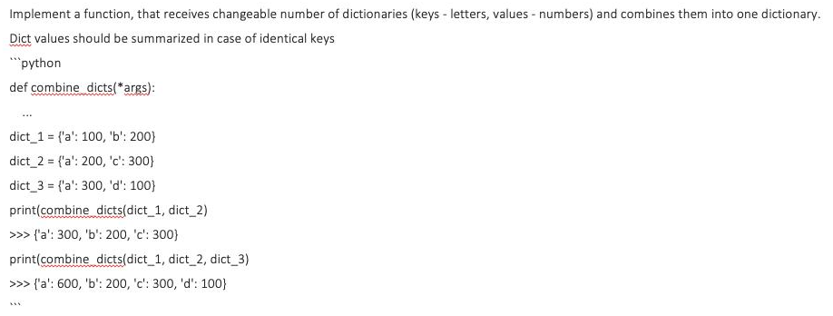
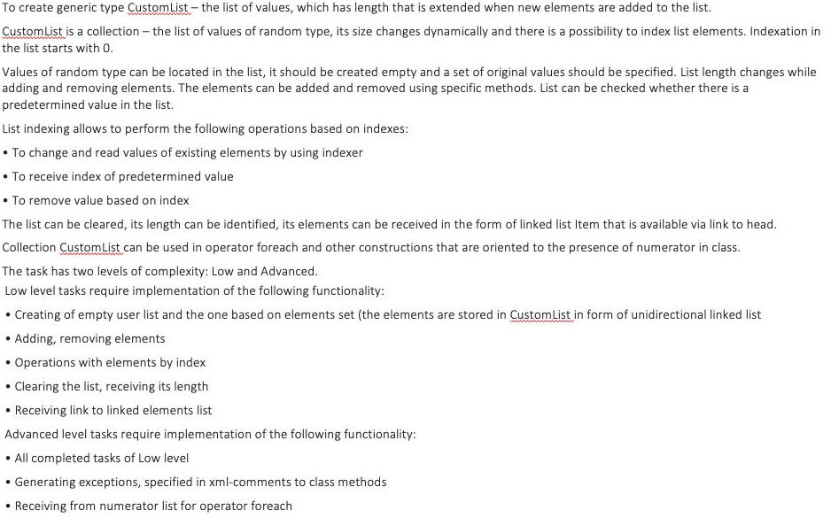

# Tasks & Solutions

### Exercise 1



Function combine_dicts takes dictionaries as arguments and sums up the values with the same key 
or adds the key-value pair if the key is not in the combined dictionary
```python
def combine_dicts(*args) -> dict:
    combined_dict = {}
    for arg in args:
        for k, v in arg.items():
            combined_dict.setdefault(k, 0)
            combined_dict[k] += v
    return combined_dict
```


### Exercise 2



To solve this task I created CustomList.py which contains two classes: Node and CustomList.  
In order to import the functionality of the CustomList module:
```python
from CustomList import CustomList, Node
```  

* Node class  
Creates node objects - elements of liked list.  
Consists of 2 methods - `__init__` and `__repr__`  
```python
class Node:
    def __init__(self, value):
        self.value = value
        self.next = None

    def __repr__(self):
        return str(self.value)
```  
`__init__` method sets 2 properties: value and next. It takes value as argument and always sets pointer next to None.  
`__repr__` method returns string representation of node's value.  

* CustomList class  

    * `__init__` method sets 2 properties: head of created list to None and its length to 0.  
    
        ```python
        def __init__(self):
            self.head = None
            self.length = 0
        ```  
    
    * `__repr__` method returns string representation of the list.  
    
        ```python
        def __repr__(self):
            nodes = '[ '
            curr = self.head
            while curr:
                nodes += (str(curr.value) + ' -> ')
                curr = curr.next
            nodes += ' ]'
            return str(nodes)
        ```  
    
    * `__iter__` method returns an iterator object for the list.  

        ```python
        def __iter__(self):
            self.num = 0
            curr = self.head
            while curr:
                yield curr
                curr = curr.next
        ```  
    * `__getitem__` method allows us to use []-notation to get elements of the list by index.
    Called to implement evaluation of self[index]. Returns Node object.  
    If the index is out of range, IndexError exception is raised.  
    
        ```python
        def __getitem__(self, index):
            if index >= self.length:
                raise IndexError('List index is out of range =)')
            count = 0
            for item in self:
                if index == count:
                    return item
                count += 1
                continue
        ```  
    * `set_item__` Called to implement assignment to self[index]. Assigns new value to the node.  
    If the index is out of range, IndexError exception is raised.  

        ```python
        def __setitem__(self, index, value):
            if index >= self.length:
                raise IndexError('List index is out of range =)')
            count = 0
            for item in self:
                if index == count:
                    item.value = value
                count += 1
                continue        
        ```  
    
    * `add` method inserts a new element at the end of the list.  
    Each call of this method increments self.length property by 1.
    
        ```python
        def add(self, value):
            self.length = 1
            if not self.head:
                self.head = Node(value)
                return
            curr = self.head
            while curr.next:
                curr = curr.next
                self.length += 1
            curr.next = Node(value)
            self.length += 1
        ```  
       
    * `find` method looks for the first element with value matching the key.  
    It returns Node object or prints the message that the value is not found.  
        ```python
        def find(self, key):
            curr = self.head
            try:
                while curr.value != key:
                    curr = curr.next
                return curr
            except AttributeError:
                print('The value not found')
        ```  
    
    * `remove_by_value` method removes the first occurence of the key in the list.  
    Each call of this method decrements self.length property by 1.
        ```python
        def remove_by_value(self, key):
            curr = self.head
            prev = None
            while curr and curr.value != key:
                prev = curr
                curr = curr.next
            if prev is None:
                self.head = curr.next
            elif curr:
                prev.next = curr.next
                curr.next = None
                self.length -= 1
        ```  
    
    * `remove_by_index` method removes the element using its index.  
    Each call of this method decrements self.length property by 1.  
    If the index is out of range, IndexError exception is raised.  

        ```python
        def remove_by_index(self, index):
            if index >= self.length:
                raise IndexError('List index is out of range =)')
            curr = self.head
            prev = None
            count = 0
            while curr and count != index:
                prev = curr
                curr = curr.next
                count += 1
            if prev is None:
                self.head = curr.next
            elif curr:
                prev.next = curr.next
                curr.next = None
                self.length -= 1
        ```  
    * `clear` function removes all elements from the list. The result is empty list.  
    Sets self.length property as 0.  
    
    ```python
    def clear(self):
        for item in self:
            self.remove_by_value(item.value)
        self.length = 0
    ```
  
# Usage
## Exercise1
```bash
exercise_1.py
```
## Exercise2
* Import CustomList module:  
```python
from CustomList import CustomList, Node
```  
* See methods and attributes of CustomList class:  
```bash
exercise_2.py
```

