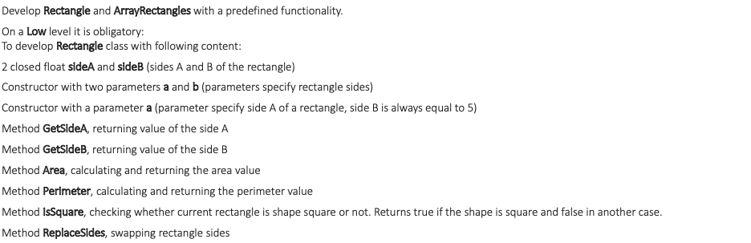
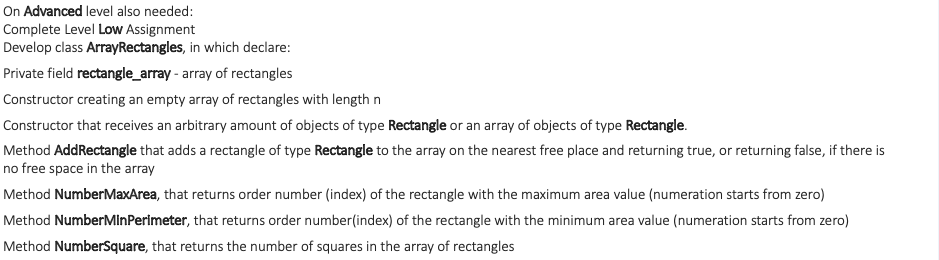
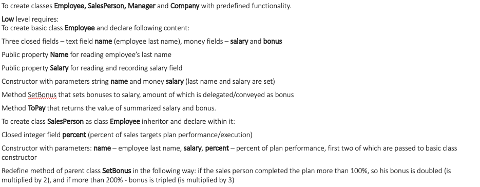
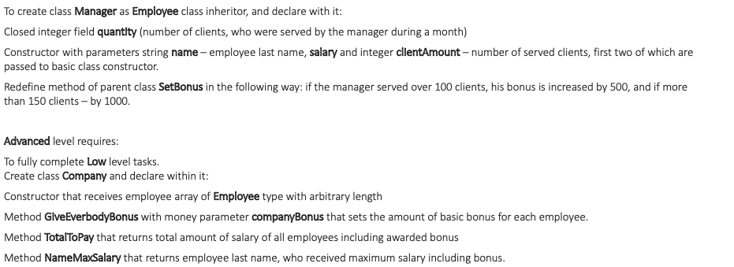

# Usage
```bash
exercise_1.py
exercise_2.py
```

# Tasks & Solutions

### Exercise 1


  

*   Rectangle class  
    * `__init__` method sets two private attributes: __sideA and __sideB (default value 5)
    ```python
    def __init__(self, sideA, sideB=5):
        self.__sideA = float(sideA)
        self.__sideB = float(sideB)
    ```  
    * `get_sideA` and `get_sideB` methods return sides of the rectangle  
    ```python
    def get_sideA(self):
        return self.__sideA
    
    def get_sideB(self):
        return self.__sideB
    ```  
    * `area` and `perimeter` methods calculate area and perimeter for the rectangle and return their values  
    ```python
    def area(self):
        area = self.__sideA * self.__sideB
        return area
    
    def perimeter(self):
        perimeter = (self.__sideA + self.__sideB) * 2
        return perimeter
    ```  
    * `is_square` method checks if the sides of the rectangle are equal  
    ```python
    def is_square(self):
        return self.__sideA == self.__sideB
    ```
    * `replace_sides` method switch the values of sides  
    ```python
    def replace_sides(self):
        self.__sideA, self.__sideB = self.__sideB, self.__sideA
    ```  

* ArrayRectangles class  
    * `__init__` method sets __add_limit and __array_rectangles attributes.  
    It takes arbitrary number of Rectangle objects or the array of Rectangle objects. 
    It will ignore any other objects or values as arguments.  
    __add_limit property is needed for the `add_rectangle` method.
    ```python
    def __init__(self, *args, add_limit=10):
        """
        :param args: Only the objects of Rectangle class will be appended to self.__array_rectangles attribute.
        If there is only one argument and it is a list of objects, the Rectangle objects of this list will be appended
        to self.__array_rectangles.
        If there are no arguments or the arguments are not Rectangle class object, self.__array_rectangles attribute
        will be an empty list.
        :param add_limit: a limit for add_rectangle method. If self.__array_rectangles >= add_limit,
        method add_rectangle will return False. Default value is 10.
        """
        self.__add_limit = add_limit
        if len(args) == 1 and isinstance(args, list):
            self.__array_rectangles = [element for element in args[0] if isinstance(element, Rectangle)]
        self.__array_rectangles = [element for element in args if isinstance(element, Rectangle)]
    ```  
    * `add_rectangle` method adds Rectangle objects to the __array_rectangles attribute (list of objects) 
    if the __add_limit is not exceeded. It returns True if the object added and False if not.
    ```python
    def add_rectangle(self, rectangle):
        """
        :param rectangle: instance of Rectangle class
        :return: If the add_limit is not exceeded and the Rectangle class object is passed as an attribute, the method
        returns True and adds the object to the self.__array_rectangles class attribute.
        """
        if len(self.__array_rectangles) < self.__add_limit and isinstance(rectangle, Rectangle):
            self.__array_rectangles.append(rectangle)
            return True
        return False
    ```  
    *  `number_max_area` and `number_min_perimeter` methods return the indices of the Rectangle objects with the highest 
    value of area and lowest value of perimeter respectively.
    ```python
    def number_max_area(self):
        """
        :return: index of the Rectangle object with the maximum area in self.__array_rectangles list.
        """
        max_area = 0
        index = 0
        for i, rectangle in enumerate(self.__array_rectangles):
            if rectangle.area() > max_area:
                max_area = rectangle.area()
                index = i
        return index
    
    def number_min_perimeter(self):
        min_perimeter = None
        index = 0
        for i, rectangle in enumerate(self.__array_rectangles):
            if min_perimeter is None:
                min_perimeter = rectangle.perimeter()
                index = i
            elif rectangle.perimeter() < min_perimeter:
                min_perimeter = rectangle.perimeter()
                index = i
        return index
    ```  
    * `number_square` method returns the number of square Rectangle objects  
    ```python
    def number_square(self):
        """
        :return: number of squares in the self.__array_rectangles list of Rectangle objects
        """
        return len([i for i in self.__array_rectangles if i.is_square()])
    ```  

### Exercise 2


  

* Employee class  
Class has protected class atribute `_company_bonus = 300`

    * `__init__` method sets __name, __salary and __bonus attributes for each employee  
    ```python
    def __init__(self, name, salary):
        self.__name = str(name)
        self.__salary = float(salary)
        self.__bonus = 0
    ```  
    * `__name` and `__salary` attributes are accesible outside the class using   `name` and `salary` properties
    ```python
    @property
    def name(self):
        return self.__name
    
    @property
    def salary(self):
        return self.__salary
    ```  
    * `set_bonus` method sets basic bonus for the employee. 
    Default value is equal to the value of `_company_bonus` class attribute
    ```python
    def set_bonus(self, bonus=_company_bonus):
        self.__bonus = bonus
    
    @property
    def bonus(self):
        return self.__bonus
    ```  
    * `to_pay` method returns the sum of bunus and salary for the employee  
    ```python
    def to_pay(self):
        return self.__salary + self.__bonus
    ```  

* SalesPerson(Employee) class  

    * `__init__` method inherits from the Employee class and adds `__percent_completed` attribute
    ```python
    def __init__(self, name, salary, percent_completed=100):
        """
        :param percent_completed: if the sales person completed the plan more than 100%, his bonus is doubled,
        if more than 200% - tripled.
        """
        super().__init__(name, salary)
        self.__percent_completed = percent_completed
    ```  
    * `set_bonus` method modifies the Employee `set_bonus` method if the conditions were met   
    ```python
    def set_bonus(self, bonus=Employee._company_bonus):
        if 100 < self.__percent_completed <= 200:
            bonus *= 2
        elif self.__percent_completed > 200:
            bonus *= 3
        super().set_bonus(bonus)
    ```  

* Manager(Employee) class  

    * `__init__` method inherits from the Employee class and adds `__client_amount` attribute
    ```python
    def __init__(self, name, salary, client_amount):
        super().__init__(name, salary)
        self.__client_amount = client_amount
    ```  
    * `set_bonus` method modifies the Employee `set_bonus` method if the conditions were met   
    ```python
    def set_bonus(self, bonus=Employee._company_bonus):
        if 100 < self.__client_amount <= 150:
            bonus += 500
        elif self.__client_amount > 150:
            bonus += 1000
        super().set_bonus(bonus)
    ```  

* Company class  

    * `__init__` method sets `__employees` atribute as a list of objects of Employee class and related classes
    ```python
    def __init__(self, *args):
        self.__employees = list(args)
    ```  
    * `give_everybody_bonus` method sets bonuses for every employee
    ```python
    def give_everybody_bonus(self):
        """
        Metod sets bonus for every employee
        """
        for employee in self.__employees:
            employee.set_bonus()
    ```  
    * `total_to_pay` method calculates total payment for all employees  
    ```python
    def total_to_pay(self):
        """
        :return: Total amount of money (salaries + bonuses)
        """
        total = 0
        for employee in self.__employees:
            total += employee.to_pay()
        return total
    ```  
    * `name_max_salary` method returns the name of the employee with highest Salary property  
    ```python
    def name_max_salary(self):
        """
        :return: Name property of the instance of Employee class with highest Salary property
        """
        max_salary_employee = None
        max_salary = 0
        for employee in self.__employees:
            if employee.salary > max_salary:
                max_salary = employee.salary
                max_salary_employee = employee
        return max_salary_employee.name
    ```