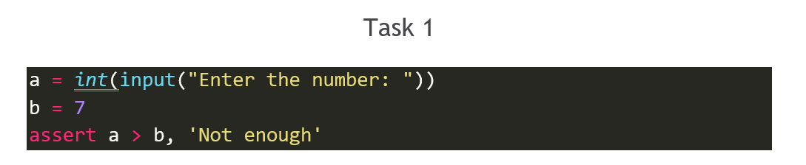

# Tasks & Solutions  

  

Output:
```
Enter the number: 5
AssertionError: Not enough
```  

  
  
Output:
```
after bar  
NameError: name 'bar' is not defined
```  

  
  
Output:
```
2
```  

  
  
Output:
```
SyntaxError: invalid syntax
```  


  
Output:
```
TypeErrore: exceptions must deriver from BaseException
```  

  

Output:
```
Enter file name: not_existing_file.txt
Input file not found
Enter file name:
```  


